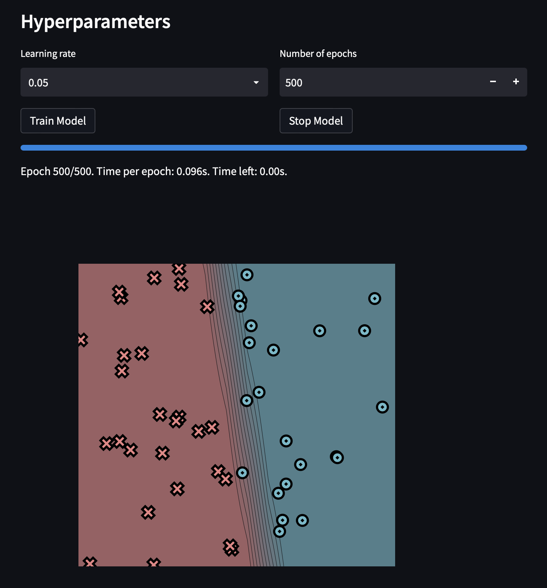
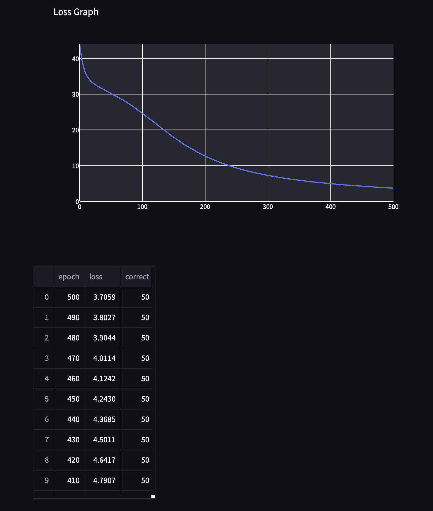
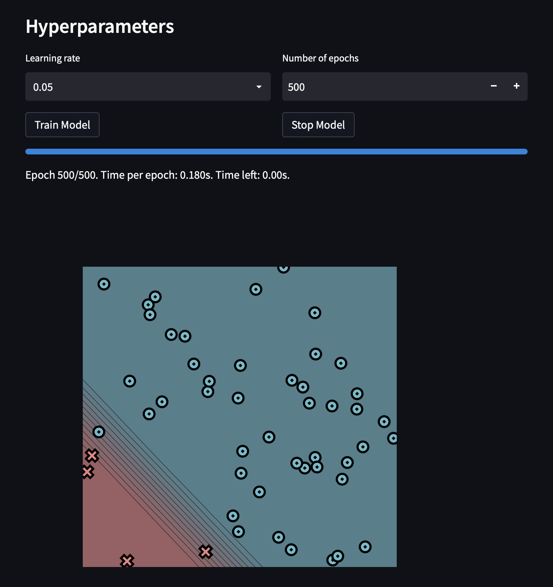
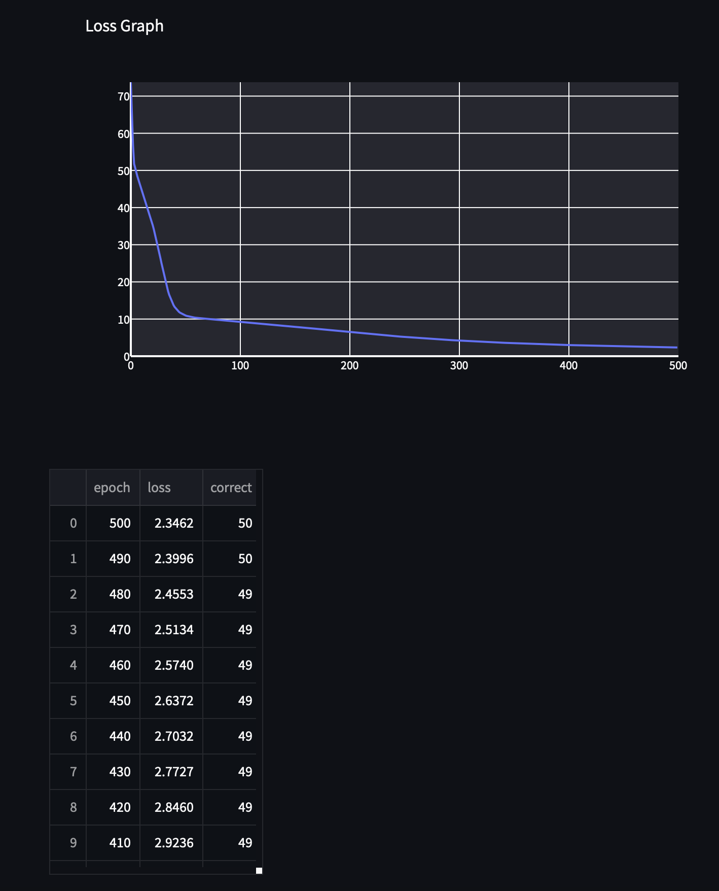
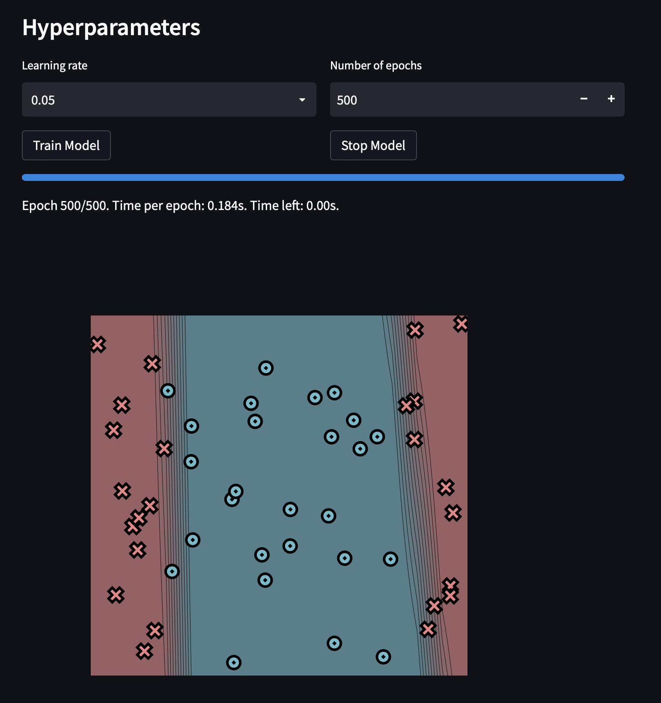
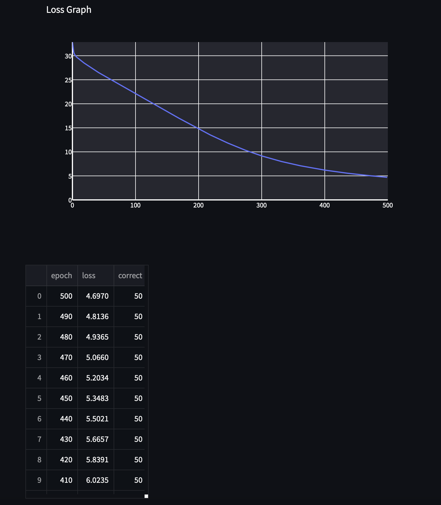
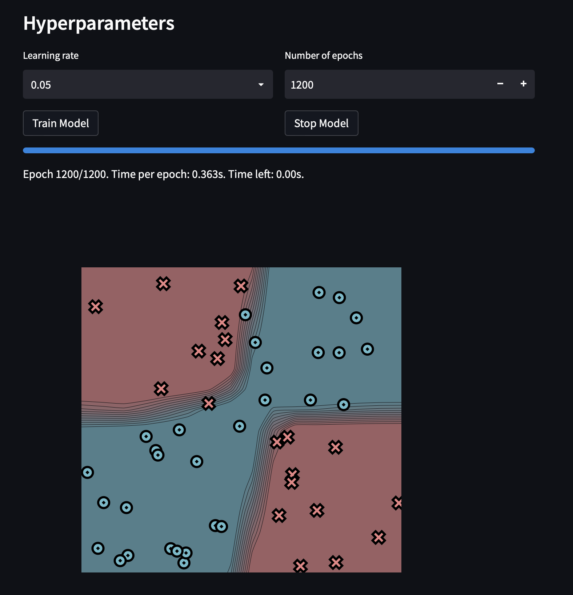
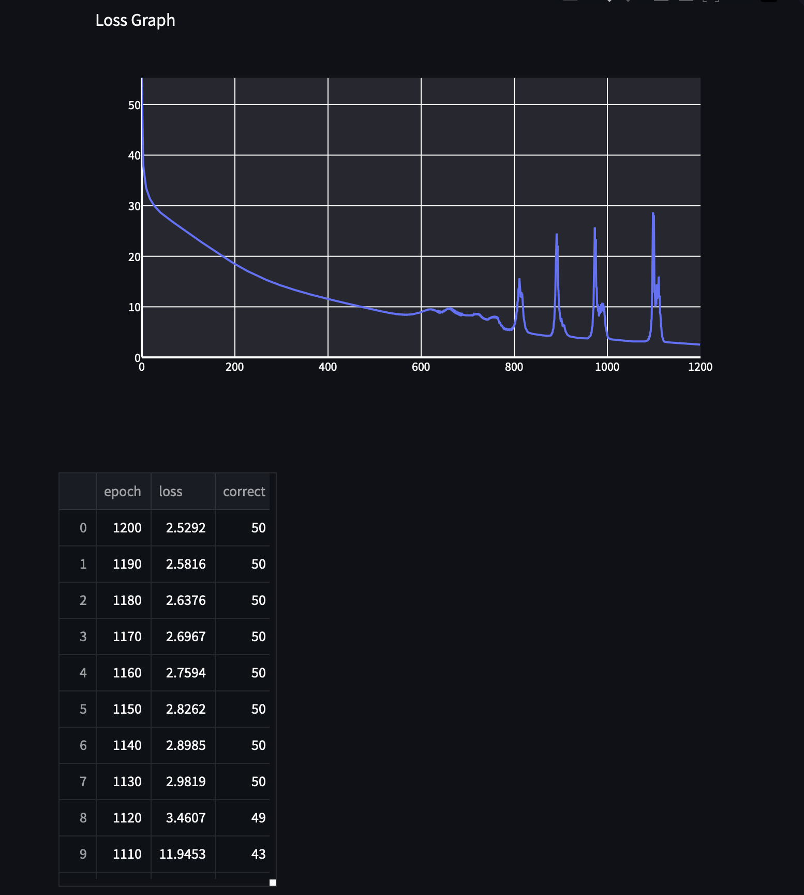

[](https://classroom.github.com/a/7COonC5j)
# MiniTorch Module 1


* Docs: https://minitorch.github.io/

* Overview: https://minitorch.github.io/module1/module1/

This assignment requires the following files from the previous assignments. You can get these by running

```bash
python sync_previous_module.py previous-module-dir current-module-dir
```

The files that will be synced are:

        minitorch/operators.py minitorch/module.py tests/test_module.py tests/test_operators.py project/run_manual.py


## Task 1.5

** Simple Dataset **

Training Log:
```
Epoch: 10/500, loss: 36.05515121824957, correct: 27
Epoch: 20/500, loss: 33.42355847905616, correct: 27
Epoch: 30/500, loss: 32.201133432865156, correct: 27
Epoch: 40/500, loss: 31.228925263566314, correct: 27
Epoch: 50/500, loss: 30.323051567963127, correct: 27
Epoch: 60/500, loss: 29.382696174176747, correct: 31
Epoch: 70/500, loss: 28.403816392276063, correct: 37
Epoch: 80/500, loss: 27.289871072379334, correct: 42
Epoch: 90/500, loss: 26.069762995714008, correct: 43
Epoch: 100/500, loss: 24.752593024479648, correct: 44
Epoch: 110/500, loss: 23.386736024745673, correct: 46
Epoch: 120/500, loss: 22.002763787139493, correct: 46
Epoch: 130/500, loss: 20.61933803867918, correct: 47
Epoch: 140/500, loss: 19.30678387332803, correct: 48
Epoch: 150/500, loss: 18.037964786872752, correct: 48
Epoch: 160/500, loss: 16.81926414150643, correct: 48
Epoch: 170/500, loss: 15.676321030142354, correct: 48
Epoch: 180/500, loss: 14.627059934585034, correct: 48
Epoch: 190/500, loss: 13.656124840394567, correct: 48
Epoch: 200/500, loss: 12.763761463570308, correct: 48
Epoch: 210/500, loss: 11.949440058794016, correct: 48
Epoch: 220/500, loss: 11.208343144204857, correct: 48
Epoch: 230/500, loss: 10.538580975200459, correct: 50
Epoch: 240/500, loss: 9.932132842435859, correct: 50
Epoch: 250/500, loss: 9.38093677388605, correct: 50
Epoch: 260/500, loss: 8.87960671321962, correct: 50
Epoch: 270/500, loss: 8.424108483577138, correct: 50
Epoch: 280/500, loss: 8.010626724098083, correct: 50
Epoch: 290/500, loss: 7.631926654642149, correct: 50
Epoch: 300/500, loss: 7.284246538848497, correct: 50
Epoch: 310/500, loss: 6.964637549905897, correct: 50
Epoch: 320/500, loss: 6.66972080366344, correct: 50
Epoch: 330/500, loss: 6.396757070539308, correct: 50
Epoch: 340/500, loss: 6.143422283765437, correct: 50
Epoch: 350/500, loss: 5.909032375252598, correct: 50
Epoch: 360/500, loss: 5.6908323693025125, correct: 50
Epoch: 370/500, loss: 5.486952897440858, correct: 50
Epoch: 380/500, loss: 5.2960883578933, correct: 50
Epoch: 390/500, loss: 5.117085320904784, correct: 50
Epoch: 400/500, loss: 4.948920978363187, correct: 50
Epoch: 410/500, loss: 4.790712000028591, correct: 50
Epoch: 420/500, loss: 4.641688223190648, correct: 50
Epoch: 430/500, loss: 4.50111271648711, correct: 50
Epoch: 440/500, loss: 4.36848203053703, correct: 50
Epoch: 450/500, loss: 4.24300197263637, correct: 50
Epoch: 460/500, loss: 4.124156412569685, correct: 50
Epoch: 470/500, loss: 4.011436045646001, correct: 50
Epoch: 480/500, loss: 3.9044055437248275, correct: 50
Epoch: 490/500, loss: 3.802666426374193, correct: 50
Epoch: 500/500, loss: 3.7058555110559888, correct: 50
```





** Diag Dataset **

Training Log:
```
Epoch: 0/500, loss: 0, correct: 0
Epoch: 10/500, loss: 45.661385976849544, correct: 4
Epoch: 20/500, loss: 36.31896419427918, correct: 4
Epoch: 30/500, loss: 23.63678456914616, correct: 47
Epoch: 40/500, loss: 13.746046903655214, correct: 46
Epoch: 50/500, loss: 11.06785229166964, correct: 46
Epoch: 60/500, loss: 10.356568683334594, correct: 46
Epoch: 70/500, loss: 10.04967530887666, correct: 46
Epoch: 80/500, loss: 9.795463720847415, correct: 46
Epoch: 90/500, loss: 9.553947385045024, correct: 46
Epoch: 100/500, loss: 9.307121258427166, correct: 46
Epoch: 110/500, loss: 9.050569264088661, correct: 46
Epoch: 120/500, loss: 8.788951521389137, correct: 46
Epoch: 130/500, loss: 8.518869215946664, correct: 46
Epoch: 140/500, loss: 8.240322594138094, correct: 46
Epoch: 150/500, loss: 7.9612393326243955, correct: 46
Epoch: 160/500, loss: 7.675754365839262, correct: 46
Epoch: 170/500, loss: 7.383433654504206, correct: 46
Epoch: 180/500, loss: 7.089348410561393, correct: 46
Epoch: 190/500, loss: 6.797316147932685, correct: 46
Epoch: 200/500, loss: 6.509226389159279, correct: 47
Epoch: 210/500, loss: 6.2215553620692825, correct: 47
Epoch: 220/500, loss: 5.9407884491507685, correct: 47
Epoch: 230/500, loss: 5.681679161999095, correct: 47
Epoch: 240/500, loss: 5.436987140124944, correct: 47
Epoch: 250/500, loss: 5.203063552843975, correct: 48
Epoch: 260/500, loss: 4.98095388959094, correct: 48
Epoch: 270/500, loss: 4.771102502235677, correct: 48
Epoch: 280/500, loss: 4.574070905885341, correct: 48
Epoch: 290/500, loss: 4.389000448042025, correct: 48
Epoch: 300/500, loss: 4.2158862828010575, correct: 49
Epoch: 310/500, loss: 4.0539062370505405, correct: 49
Epoch: 320/500, loss: 3.902661212920098, correct: 49
Epoch: 330/500, loss: 3.7613339004466004, correct: 49
Epoch: 340/500, loss: 3.629433665412614, correct: 49
Epoch: 350/500, loss: 3.50675561893253, correct: 49
Epoch: 360/500, loss: 3.392502031124091, correct: 49
Epoch: 370/500, loss: 3.285962612120111, correct: 49
Epoch: 380/500, loss: 3.1867246165047294, correct: 49
Epoch: 390/500, loss: 3.0933972880805873, correct: 49
Epoch: 400/500, loss: 3.0060010441586433, correct: 49
Epoch: 410/500, loss: 2.9235998365350526, correct: 49
Epoch: 420/500, loss: 2.845966758631098, correct: 49
Epoch: 430/500, loss: 2.772674588578309, correct: 49
Epoch: 440/500, loss: 2.703228378080229, correct: 49
Epoch: 450/500, loss: 2.637198968294806, correct: 49
Epoch: 460/500, loss: 2.573990636013098, correct: 49
Epoch: 470/500, loss: 2.5133989811821498, correct: 49
Epoch: 480/500, loss: 2.4552825690914837, correct: 49
Epoch: 490/500, loss: 2.399572814690039, correct: 50
Epoch: 500/500, loss: 2.3462324549110614, correct: 50
```





** Split Dataset **

Training Log:
```
Epoch: 0/500, loss: 0, correct: 0
Epoch: 10/500, loss: 29.44983183013999, correct: 40
Epoch: 20/500, loss: 28.4377230014433, correct: 40
Epoch: 30/500, loss: 27.534265155820293, correct: 40
Epoch: 40/500, loss: 26.70189533614504, correct: 42
Epoch: 50/500, loss: 25.9486361167907, correct: 42
Epoch: 60/500, loss: 25.234339166129665, correct: 41
Epoch: 70/500, loss: 24.47087118864902, correct: 41
Epoch: 80/500, loss: 23.697741871086052, correct: 44
Epoch: 90/500, loss: 22.92371966724127, correct: 45
Epoch: 100/500, loss: 22.166076246237402, correct: 45
Epoch: 110/500, loss: 21.42180031799019, correct: 45
Epoch: 120/500, loss: 20.67355901821483, correct: 45
Epoch: 130/500, loss: 19.933108148843946, correct: 45
Epoch: 140/500, loss: 19.19265393788529, correct: 45
Epoch: 150/500, loss: 18.45266236633202, correct: 47
Epoch: 160/500, loss: 17.714701878644437, correct: 47
Epoch: 170/500, loss: 16.98431946574993, correct: 47
Epoch: 180/500, loss: 16.25775518368467, correct: 47
Epoch: 190/500, loss: 15.539309878312718, correct: 48
Epoch: 200/500, loss: 14.834689107916102, correct: 48
Epoch: 210/500, loss: 14.1499626884358, correct: 48
Epoch: 220/500, loss: 13.491608596998256, correct: 48
Epoch: 230/500, loss: 12.858883924611234, correct: 48
Epoch: 240/500, loss: 12.254824613804159, correct: 48
Epoch: 250/500, loss: 11.676015494702023, correct: 48
Epoch: 260/500, loss: 11.123137484378764, correct: 49
Epoch: 270/500, loss: 10.594177357898358, correct: 49
Epoch: 280/500, loss: 10.09651429447208, correct: 49
Epoch: 290/500, loss: 9.631522981626427, correct: 49
Epoch: 300/500, loss: 9.198382024164365, correct: 49
Epoch: 310/500, loss: 8.794520309602326, correct: 49
Epoch: 320/500, loss: 8.41896567018499, correct: 49
Epoch: 330/500, loss: 8.070246612222348, correct: 49
Epoch: 340/500, loss: 7.745991032905741, correct: 49
Epoch: 350/500, loss: 7.445468763125121, correct: 49
Epoch: 360/500, loss: 7.165161026692379, correct: 49
Epoch: 370/500, loss: 6.90335912493681, correct: 49
Epoch: 380/500, loss: 6.659947597932054, correct: 49
Epoch: 390/500, loss: 6.432511441034684, correct: 49
Epoch: 400/500, loss: 6.220842357588423, correct: 49
Epoch: 410/500, loss: 6.023462651012142, correct: 50
Epoch: 420/500, loss: 5.83912254126267, correct: 50
Epoch: 430/500, loss: 5.66571709975756, correct: 50
Epoch: 440/500, loss: 5.5021178690884245, correct: 50
Epoch: 450/500, loss: 5.348314281369949, correct: 50
Epoch: 460/500, loss: 5.203384915067375, correct: 50
Epoch: 470/500, loss: 5.065965696624163, correct: 50
Epoch: 480/500, loss: 4.9364900946918375, correct: 50
Epoch: 490/500, loss: 4.813576771723818, correct: 50
Epoch: 500/500, loss: 4.696968052453909, correct: 50
```





** XOR Dataset **

Training Log:
```
Epoch: 0/1000, loss: 0, correct: 0
Epoch: 10/1200, loss: 33.75251558452153, correct: 28
Epoch: 20/1200, loss: 31.111762112135242, correct: 34
Epoch: 30/1200, loss: 29.737385884289804, correct: 37
Epoch: 40/1200, loss: 28.745449866046613, correct: 37
Epoch: 50/1200, loss: 27.973401460608784, correct: 38
Epoch: 60/1200, loss: 27.292023551090093, correct: 38
Epoch: 70/1200, loss: 26.626650430057058, correct: 38
Epoch: 80/1200, loss: 25.929929127173633, correct: 39
Epoch: 90/1200, loss: 25.282342015055733, correct: 41
Epoch: 100/1200, loss: 24.64778179293252, correct: 41
Epoch: 110/1200, loss: 24.00926001017664, correct: 41
Epoch: 120/1200, loss: 23.367988519611696, correct: 41
Epoch: 130/1200, loss: 22.742626748456075, correct: 41
Epoch: 140/1200, loss: 22.109286649798886, correct: 41
Epoch: 150/1200, loss: 21.47616838250072, correct: 41
Epoch: 160/1200, loss: 20.84737711489128, correct: 42
Epoch: 170/1200, loss: 20.234186785281075, correct: 44
Epoch: 180/1200, loss: 19.642866184197718, correct: 43
Epoch: 190/1200, loss: 19.06650398535309, correct: 44
Epoch: 200/1200, loss: 18.51089735971383, correct: 44
Epoch: 210/1200, loss: 17.977787307942332, correct: 44
Epoch: 220/1200, loss: 17.46642111320724, correct: 44
Epoch: 230/1200, loss: 16.975405146897657, correct: 44
Epoch: 240/1200, loss: 16.509899062638528, correct: 44
Epoch: 250/1200, loss: 16.069326137031897, correct: 44
Epoch: 260/1200, loss: 15.654235338390134, correct: 44
Epoch: 270/1200, loss: 15.266761505949258, correct: 44
Epoch: 280/1200, loss: 14.898303334680232, correct: 44
Epoch: 290/1200, loss: 14.546757008431173, correct: 45
Epoch: 300/1200, loss: 14.215620031730781, correct: 45
Epoch: 310/1200, loss: 13.906561734862581, correct: 45
Epoch: 320/1200, loss: 13.606153495790103, correct: 45
Epoch: 330/1200, loss: 13.320108985427451, correct: 45
Epoch: 340/1200, loss: 13.046286119799618, correct: 45
Epoch: 350/1200, loss: 12.783353865209268, correct: 45
Epoch: 360/1200, loss: 12.52581620614649, correct: 45
Epoch: 370/1200, loss: 12.277132665357575, correct: 45
Epoch: 380/1200, loss: 12.03848178816649, correct: 45
Epoch: 390/1200, loss: 11.800895721430964, correct: 45
Epoch: 400/1200, loss: 11.573927301153276, correct: 45
Epoch: 410/1200, loss: 11.351401217552487, correct: 45
Epoch: 420/1200, loss: 11.1293608410131, correct: 45
Epoch: 430/1200, loss: 10.91373137521402, correct: 45
Epoch: 440/1200, loss: 10.69272586235183, correct: 45
Epoch: 450/1200, loss: 10.479821630384002, correct: 45
Epoch: 460/1200, loss: 10.266452644296665, correct: 45
Epoch: 470/1200, loss: 10.052595163655972, correct: 45
Epoch: 480/1200, loss: 9.841592567812707, correct: 45
Epoch: 490/1200, loss: 9.614858897073319, correct: 45
Epoch: 500/1200, loss: 9.408931602701577, correct: 45
Epoch: 510/1200, loss: 9.211352672589845, correct: 45
Epoch: 520/1200, loss: 9.017656988409826, correct: 45
Epoch: 530/1200, loss: 8.829796902880375, correct: 46
Epoch: 540/1200, loss: 8.662600309732989, correct: 47
Epoch: 550/1200, loss: 8.52641802810415, correct: 47
Epoch: 560/1200, loss: 8.44269955761027, correct: 47
Epoch: 570/1200, loss: 8.4182381983858, correct: 47
Epoch: 580/1200, loss: 8.503134114819199, correct: 47
Epoch: 590/1200, loss: 8.602628244510717, correct: 47
Epoch: 600/1200, loss: 8.941943836667235, correct: 47
Epoch: 610/1200, loss: 9.31232546921012, correct: 47
Epoch: 620/1200, loss: 9.514188024724891, correct: 46
Epoch: 630/1200, loss: 9.352623657934, correct: 47
Epoch: 640/1200, loss: 9.04191206926184, correct: 47
Epoch: 650/1200, loss: 9.24417761532842, correct: 46
Epoch: 660/1200, loss: 9.714095375807698, correct: 47
Epoch: 670/1200, loss: 9.340586813513191, correct: 47
Epoch: 680/1200, loss: 8.779795564356805, correct: 47
Epoch: 690/1200, loss: 8.487530788135624, correct: 47
Epoch: 700/1200, loss: 8.402729529965185, correct: 47
Epoch: 710/1200, loss: 8.444169479436628, correct: 48
Epoch: 720/1200, loss: 8.72399455072818, correct: 47
Epoch: 730/1200, loss: 8.24831999678977, correct: 48
Epoch: 740/1200, loss: 7.690675714878221, correct: 48
Epoch: 750/1200, loss: 7.951752317069642, correct: 48
Epoch: 760/1200, loss: 8.18201533167661, correct: 47
Epoch: 770/1200, loss: 6.994133023216963, correct: 48
Epoch: 780/1200, loss: 5.754675185451484, correct: 48
Epoch: 790/1200, loss: 5.458991073865385, correct: 48
Epoch: 800/1200, loss: 6.2307429837118535, correct: 49
Epoch: 810/1200, loss: 13.464993440700015, correct: 44
Epoch: 820/1200, loss: 9.233394188054147, correct: 47
Epoch: 830/1200, loss: 5.007514470155749, correct: 48
Epoch: 840/1200, loss: 4.654592912812981, correct: 48
Epoch: 850/1200, loss: 4.499498915147328, correct: 48
Epoch: 860/1200, loss: 4.3742889322173575, correct: 48
Epoch: 870/1200, loss: 4.260924467621159, correct: 48
Epoch: 880/1200, loss: 4.464333113071859, correct: 49
Epoch: 890/1200, loss: 17.391595253007686, correct: 42
Epoch: 900/1200, loss: 7.925116614682925, correct: 47
Epoch: 910/1200, loss: 5.645056372055777, correct: 49
Epoch: 920/1200, loss: 4.164011163875397, correct: 49
Epoch: 930/1200, loss: 3.9453475659040147, correct: 48
Epoch: 940/1200, loss: 3.8161029974565643, correct: 48
Epoch: 950/1200, loss: 3.7289014066131787, correct: 49
Epoch: 960/1200, loss: 3.8720177992243667, correct: 49
Epoch: 970/1200, loss: 8.342046955786577, correct: 47
Epoch: 980/1200, loss: 10.334915560615638, correct: 46
Epoch: 990/1200, loss: 10.781525807294107, correct: 46
Epoch: 1000/1200, loss: 4.499550350837463, correct: 49
Epoch: 1010/1200, loss: 3.5578821426682317, correct: 48
Epoch: 1020/1200, loss: 3.4425323604150173, correct: 49
Epoch: 1030/1200, loss: 3.3519836039497517, correct: 49
Epoch: 1040/1200, loss: 3.2684780370573687, correct: 50
Epoch: 1050/1200, loss: 3.1913553423590466, correct: 50
Epoch: 1060/1200, loss: 3.1231717338045164, correct: 50
Epoch: 1070/1200, loss: 3.081441269859123, correct: 50
Epoch: 1080/1200, loss: 3.123415201761196, correct: 49
Epoch: 1090/1200, loss: 3.655625012333337, correct: 49
Epoch: 1100/1200, loss: 21.62787234770266, correct: 42
Epoch: 1110/1200, loss: 11.945280924912032, correct: 43
Epoch: 1120/1200, loss: 3.4607472938463677, correct: 49
Epoch: 1130/1200, loss: 2.98189657085716, correct: 50
Epoch: 1140/1200, loss: 2.898476300634133, correct: 50
Epoch: 1150/1200, loss: 2.826172877614696, correct: 50
Epoch: 1160/1200, loss: 2.759387876227928, correct: 50
Epoch: 1170/1200, loss: 2.696683374663542, correct: 50
Epoch: 1180/1200, loss: 2.6375540822926196, correct: 50
Epoch: 1190/1200, loss: 2.5815621569279648, correct: 50
Epoch: 1200/1200, loss: 2.5291746718751993, correct: 50
```


