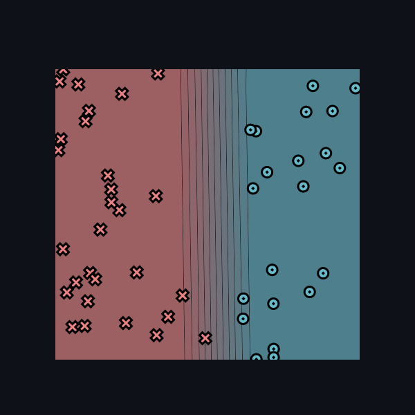
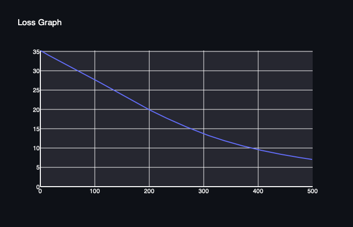
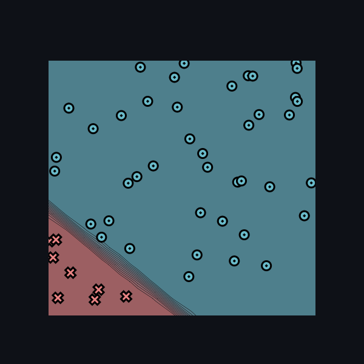
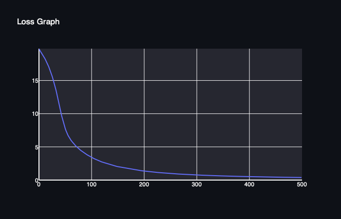
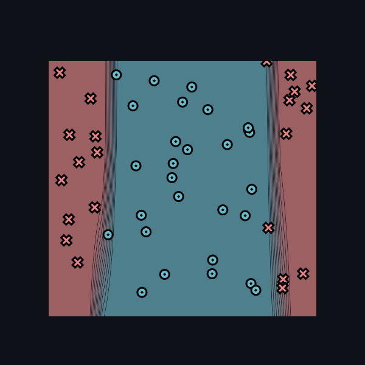
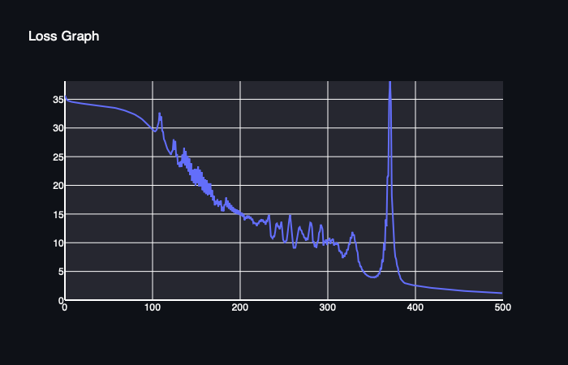
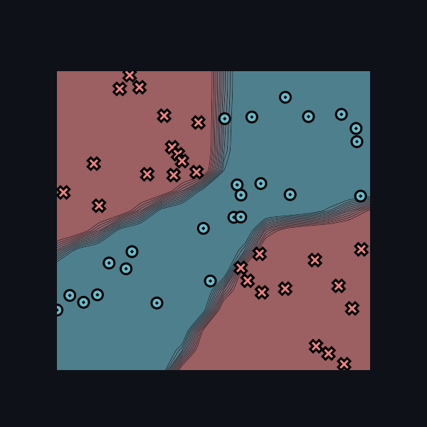

[](https://classroom.github.com/a/7COonC5j)
# MiniTorch Module 1


* Docs: https://minitorch.github.io/

* Overview: https://minitorch.github.io/module1/module1/

This assignment requires the following files from the previous assignments. You can get these by running

```bash
python sync_previous_module.py previous-module-dir current-module-dir
```

The files that will be synced are:

        minitorch/operators.py minitorch/module.py tests/test_module.py tests/test_operators.py project/run_manual.py

---

# Experiment Results

## Dataset: Simple
**Settings:**
- Number of Points: 50
- Size of Hidden Layers: 2
- Learning Rate: 0.05
- Number of Epochs: 500

### Epoch Data

| Epoch | Loss               | Correct |
|-------|---------------------|---------|
| 10    | 34.50390856596501   | 29      |
| 20    | 33.72851620221971   | 29      |
| 30    | 32.95738859923111   | 29      |
| 40    | 32.18373528159741   | 29      |
| 50    | 31.429198187923095  | 29      |
| ...   | ...                 | ...     |
| 500   | 7.0412500262870115  | 50      |

### Result Graph


### Loss Function Graph


---

## Dataset: Diag
**Settings:**
- Number of Points: 50
- Size of Hidden Layers: 2
- Learning Rate: 0.5
- Number of Epochs: 500

### Epoch Data

| Epoch | Loss               | Correct |
|-------|---------------------|---------|
| 10    | 19.570747643680978  | 42      |
| 20    | 17.237458734458972  | 42      |
| 30    | 13.822517725353968  | 42      |
| 40    | 10.004252883314761  | 45      |
| 50    | 7.206963203817627   | 49      |
| ...   | ...                 | ...     |
| 500   | 0.1295025933867659  | 50      |

### Result Graph


### Loss Function Graph


---

## Dataset: Split
**Settings:**
- Number of Points: 50
- Size of Hidden Layers: 10
- Learning Rate: 0.5
- Number of Epochs: 500

### Epoch Data

| Epoch | Loss               | Correct |
|-------|---------------------|---------|
| 10    | 34.50792351208606   | 33      |
| 20    | 34.26654844078368   | 29      |
| 30    | 34.10514583704368   | 29      |
| 40    | 33.927933427964284  | 29      |
| 50    | 33.714688939835035  | 29      |
| ...   | ...                 | ...     |
| 500   | 1.2128787777396557  | 50      |

### Result Graph


### Loss Function Graph


---

## Dataset: Xor
**Settings:**
- Number of Points: 50
- Size of Hidden Layers: 10
- Learning Rate: 0.5
- Number of Epochs: 800

### Epoch Data

| Epoch | Loss               | Correct |
|-------|---------------------|---------|
| 10    | 31.91553029321811   | 37      |
| 20    | 29.93592435304026   | 42      |
| 30    | 26.623344249523623  | 44      |
| 40    | 26.961060029435963  | 27      |
| 50    | 20.59255492514339   | 44      |
| ...   | ...                 | ...     |
| 800   | 0.2670621819198018  | 50      |

### Result Graph


### Loss Function Graph


